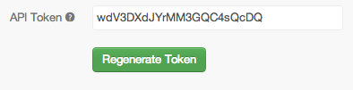

# Gridinit::Jmeter

Tired of using the JMeter GUI or looking at hairy XML files?

This gem lets you write test plans for JMeter in your favourite text editor, and optionally run them on gridinit.com

## Installation

Install it yourself as:

    $ gem install gridinit-jmeter

## Basic Usage

*Gridinit::Jmeter* exposes easy-to-use domain specific language for fluent communication with [JMeter](http://jmeter.apache.org/). As the name of the gem suggests, it also includes API integration with [Gridinit](http://gridinit.com), a cloud based load testing service.

To use the DSL, first let's require the gem:

```ruby
require 'rubygems'
require 'gridinit-jmeter'
```

### Basic Example
Let's create a `test` and save the related `jmx` testplan to file, so we can edit/view it in JMeter.

```ruby
test do
  threads 10 do
    visit 'Google Search', 'http://google.com'
  end
end.jmx
```

So in this example, we just created a test plan, with 10 threads, each of which visited the search page at google.com. If you're new to Ruby, but familar with blocks you will see each of the code blocks are delimited by `do` and `end` statements. If you feel more comfortable, you can also use braces like this.

```ruby
test {
  threads 10 {
    visit 'Google Search', 'http://google.com'
  }
}.jmx
```

### Generating a JMeter Test Plan (JMX)
Note also how we called the `.jmx` method of the test block. Calling this method will write the contents of the JMeter test plan to screen (stdout) and also to a file like this.

```xml
<?xml version="1.0" encoding="UTF-8"?>
<jmeterTestPlan version="1.2" properties="2.1">
  <hashTree>
    <TestPlan guiclass="TestPlanGui" testclass="TestPlan" testname="Test Plan" enabled="true">
      ...
    </TestPlan>
  </hashTree>
</jmeterTestPlan>
JMX saved to: jmeter.jmx
```

The file that is created can then be executed in the JMeter GUI. If you want to create the file with a different filename and/or path, just add the `file:` parameter the `.jmx` method call like this.

```ruby
test do
  threads 10 do
    visit 'Google Search', 'http://google.com'
  end
end.jmx(file: "/tmp/my_testplan.jmx")
```

Windows users should specify a path like this.

```ruby
.jmx(file: "C:\\TEMP\\MyTestplan.jmx")
```

### Running a JMeter Test Plan locally
You can execute the JMeter test plan by calling the `.run` method of the test block like this.

```ruby
test do
  threads 10 do
    visit 'Google Search', 'http://google.com'
  end
end.run
```

This will launch JMeter in headless (non-GUI mode) and execute the test plan. This is useful for shaking out the script before you push it to the Grid. There are a few parameters that you can set such as the `path:` to the JMeter binary, `file:` path/name for the JMX file, `log:` path/name to output JMeter logs and `jtl:` path/name for JMeter results like this.

```ruby
test do
  threads 10 do
    visit 'Google Search', 'http://google.com'
  end
end.run(
  path: '/usr/share/jmeter/bin/', 
  file: 'jmeter.jmx', 
  log: 'jmeter.log', 
  jtl: 'results.jtl')
```

### Running a JMeter Test Plan on Gridinit.com

As the gem name implies, you can also execute JMeter test plans on Gridinit.com using our API. To do so, you require an account and API token. If you don't know your token, sign in to the Grid and [generate a new token](http://gridinit.com/api)



To execute the test on the Grid, call the `.grid` method on the test block and pass it the API token like this.

```ruby
test do  
  threads 10 do
    visit 'Google Search', 'http://google.com'  
  end  
end.grid('OxtZ-4v-v0koSz5Y0enEQQ')
```

This will then provide you with a link to the live test results on the Grid like this.

``` 
Results at: http://prod.gridinit.com/shared?testguid=73608030311611e2962f123141011033&run_id=339&tags=jmeter&domain=google.com&cluster=54.251.48.129&status=running&view=
```

## Advanced Usage


## Roadmap

This is very much a work-in-progress. Future work is being sponsored by Gridinit.com. Get in touch with us if you'd like to be involved.

## Contributing

1. Fork it
2. Create your feature branch (`git checkout -b my-new-feature`)
3. Commit your changes (`git commit -am 'Add some feature'`)
4. Push to the branch (`git push origin my-new-feature`)
5. Create new Pull Request
